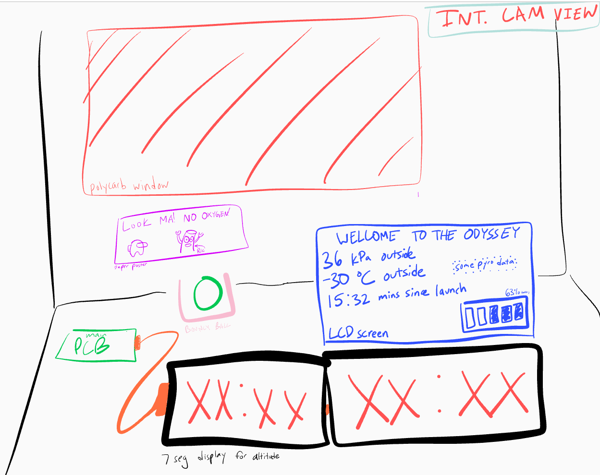

# Odyssey

> a project for [apex.hackclub.com](https://apex.hackclub.com) by Meghana Madiraju and help from Kieran Klukas

I have been in love with space for as long as I can remember, so when I heard Hack Club was letting teenagers send whatever they want 113,000 feet in the air I knew I had to do it. We get $100 per person to make an invention that'll go onto a high altitude balloon (HAB), and if you spend 30 hours on it you'll get to go to Boston for a hackathon where everyone will launch their payloads at the same time and make cool stuff.

## Quick Overview (what we're sending up)
- Sensor data from SMD components on PCB (stored on a microSD card)
- PCB powered by 3 AA batteries that can survive -45C
- Internal camera that can see outside through a polycarbonate window on the wall
- 8 digit 7-segment display that show the current altitude, which the int. camera can also see

## Collected data
- Pressure
- Magnetic field (3-axis)
- Internal temperature of payload
- Gyroscopic data (3-axis)

## Component Stack
| Component | Purpose |
| --------- | ------- |
| Seeed Studio XIAO RP2040 | Main microcontroller |
| MS560702BA03-50 | Altimeter |
| MPU-6050 | Gyroscope/accelerometer |
| ALS31313KLEATR-1000 | Magnetometer |
| Mini Body Cam | Internal view of payload |      

View the complete BOM [here](https://docs.google.com/spreadsheets/d/1y77u3fouo9j1fYMRJqijLE8DN1v_GkXtAQhd4oCJCtc/edit?usp=sharing)          
 
## PCB
             
 

## Timeline
| Phase | Status (%)|
| ------ | ------ |
| Research + Planning | 99% |
| Designing PCB and electronics layout | 98% | 
| Building payload | 60% |
| Coding firmware | 95% |
| Final tests and edits | 0% |
| Launch | 0% |

## Design Process
My first sketch of Odyssey looked like this:
 

 
The main PCB (the green square artfully drawn in the center, complete with blue copper traces) with the XIAO and SMDs would process and collect data. The 4 digit 7-segment display displays the altitude of the payload (math that would be calculated from the barometer), and would sit in front of an internal camera (the purple box) so the altitude could be captured in the video feed. The internal camera would also look outside via the polycarbonate window that I am going to steal from my robotics team's shop (sorry Mr. S).      
The camera on top was originally meant to capture the sky, but then I found out all the payloads would be aligned on top of eachother candy-necklace style, so I scrapped that pretty quick.

The second sketch had some improvements:
 

 

I thought that we would need 3 PCBs: one for the main sensors, one for the LCD screen and 7-seg display, and one for the pyranometer. What's overkill? This obviously was taken out after I thought about a bit more (see: overkill) and after I saw the customs and duties taxes. The yellow stuff you see on the walls is my artistic interpretation of spray insulation.      

I really wanted our data to be space-focused, so getting a pyranometer to measure cosmic ray data was at the top of my list. Unfortunately, the Apogee Instrument component I found was a massive pain to work with, so I decided to just scrap it. If I get the basic functionality of everything else working, then I'll look into aurora borealis or radiation detection. The challenge is that those have to be on the outside of the payload, or at least shielded solely by polycarb or some other low-z window material.

I also drew a sketch of what I wanted the internal view to be:
 

 

Here's an updated internal view with a smaller box and an updated layout:
 

 

At this point, I planned for a PCB to store data from 3 sensors onto a microSD card, an internal camera that I charged to take a video of the entire flight, and 2 4-digit 7-segment displays to show the altitude as the payload rose. I hadn't yet figured out how to power the 7seg displays, or how I was going to control it (since the PCB didn't have enough open GPIO pins). I ordered 2 PCBAs of JLCPCB (I had to ship it to my friend in Canada, who then shipped it to me, to avoid the tariffs), Kieran and I soldered  the XIAO RP2040 on the back, and we started reading from the sensors.      
 

 
I wanted the current altitude of the payload displayed on two 4-digit 7-segment displays so that the internal camera could see it, and realized quickly that I would need like 28 GPIO pins if I directly connected them both to a microcontroller, so that was a no go. I then found out that there's ICs that are made for controlling these kinds of things, so I spent the last of my $100 grant and got to work.

Bit of a change in plans. The MAX7219 driver chip I wanted to use to control the 7 segment displays didn't work and the libraries people used were like falling apart, so I was on the verge of severely rethinking plans. Then, Kieran came up with the wonderful idea of transmitting the altimeter data from the XIAO RP2040 (on the main PCB) to another microcontroller, so that we would have enough GPIO pins to directly wire the 7seg display.

Then, we remembered that we need two 4 digit 7seg displays, so we were like "let's send data from the xiao rp2040 to 2 other microcontrollers, one has the first 4 digits of the altitude and one has the last 4." Insane. So I'm working on that right now. We got connection between the xiao rp2040 and a xiao nrf52840 sense, but the sense doesn't have enough GPIO pins so Kieran kindly decided to lend me 2 orpheus picos (shout out Adam).
> An Orpheus Pico is a cheaper version of the raspberry pi pico made by @adammakesthingsdev that Hack Club used to make and distribute to people

I keep getting a transmission timing error between the xiao rp2040 and the pico, and I don't know how to fix it. Part of me thinks it's how I wired my pull up resistors (translating breadboard wiring to parallel and series diagrams in my head is rough), but I have no idea. At least I can flash code on the pico now, I dealt with a BOOTSEL issue for like 3 hours yesterday.

So after days of trying to get I2C to work, I decided to switch to SPI. And I kept getting errors there too. I think I've discovered my problem: because I'm using an orpheus pico but setting Arduino IDE's board to a raspberry pi pico, the default MOSI, MISO, and SCK (and therefore the SCL and SDA) pins don't match the orpheus pico's (because they have different internal stuff). So the problem was arduino the whole time. I knew that was gonna be an issue. Damn it. When I tried to set the SDA and SCL pins before Wire.begin() the pico used to crash and not execute any code, that's why I switched to SPI. this is crazy.

So, I'm spending more money. I've given up on communicating between the xiao rp2040 and another microcontroller. I'm going to buy an 8 digit 7seg display that has 5 pins that I can directly wire to my xiao rp2040. My only concern is that it uses the same MAX7219 driver chip that didn't work for me before (and whose library was also garbage), but other people got this thing to work and maybe those errors was me wiring wrong or doing something dumb. I've been trying for like a week to get this right and now I have to just pray to god that this New Method will work. This sucks balls.

The new display came, and after it (inevitably) didn't work, I resoldered the connections I had. Who knew that when your wires look like this some stuff is bound to break?

Anyway, here's what it looked like after. 

> I made the mistake of getting 16 gauge wire. I spent ages at Lowe's trying to find like reasonable electrical wire but all of it was like Lamp Wire or Speaker Wire or Roof Tubing Heavy Duty Fracking Wire. Then, I tried to look for 24 gauge wire (thanks @Karmanyaah) but apparently none exists within a 50 mile radius of me so I had to buy it from amazon and get it shipped the next day. What you see above is me thinning out the ends of the wire so I can actually solder it. I've added an "idiot" column to my BOM.            

The display worked! Wow, the wonders of not being lazy.

But that was on the wrong microcontroller. I'd gotten it to work on the XIAO nRF52840 Sense that I had because, for some reason, it wouldn't work on my xiao RP2040. I dug out my dad's multimeter and found out it wasn't because of my soldering (win), but because of STUPID PIN ASSIGNMENTS. WHAT THE FREAK. On the xiao nRF you just put the GPIO assignment (D7 = 7), which is fine. But on the xiao rp2040 for some reason D10 is actually 3??? What?? Anyway, I got it work.

So with my camera set up (I had to buy another one since the first one was too cheap to work), the inside of the payload will look a bit like this. (the camera quality is better than this, I'm using a screenshot from a video of a video)

I've weighed the thing and I'm about 100g over (the whole thing is supposed to be 3/4 lbs or ~340 grams), so I'm planning to build the entire thing, be as wire-conscious as possible, and use my soldering iron to burn away any excess weight I might have after it's all done.
> Fun Fact: Burnt stryofoam fumes are carcinogenic!

I'm glad I'm not like insanely overweight because I hadn't weighed it up till now and was just kind of praying.

Yeah okay it's overweight. I didn't realize how much 100g of styrofoam actually was. It's like, a lot. I spent 10 minutes using my crappy $10 soldering iron to burn/melt away some of the sides of the box, and then I just started coughing a ton so I was like "that's probably a sign to stop" 

> did I mention styrofoam fumes are carcinogenic?

Anyway, I only got a gram off or something. 

Then, as I waited for my bedroom to stop becoming a Hazardous Zone, I went outside and started chopping away at the box with a massive serated kitchen knife. That only yielded about a gram, too. No dice.
> My window was open and the ceiling fan was running. My lungs feel okay.
                  
              
Then I was just like "screw it" and destroyed my box to make a smaller one. An hour later, ta da! All that funky texture is my previous attempt at burning away material, and (as I'm sure you can guess) ruining my soldering iron in the process. It's strong, it'll push through.

Updated inside view (no wires): 

Tomorrow I'll glue the sides of the box together with gorilla glue and spray insulation/gap filler, and then I'll start soldering. We're so back.
> It's 2am.

So I sprayed insulation and gap filler and got everything pretty nice and laid out. I soldered the entire circuit and with some minor adjustments (I soldered the wrong pins of the rocker switch and I switched the 5V and GND junctions), it worked. My 7 segment display is showing altitude and everything is awesome.

So then I stuck all its guts inside, taped some stuf down, and it now looks like this. Everything is awesome.

So remember when I said everything is awesome? Turns out it's not. I'd run code for the 7 segment display and that worked, and I had code to log sensor data onto the microSD card, so I assumed everything would be fine when you put them together. Well was it? No, of course not. I was using SPI communication for both storing data on the microSD card and communicating with the 7 segment display. When I implemented the LedControl library in my log code, my display worked but it kept printed "Error opening file" to the serial monitor.

_Frick_ 

The display and SD card trying to communicate at the same time was screwing everything up, because signals it was sending overlapped with eachother and caused a bunch of nonsense. I immediately assumed that the problem couldn't be fixed, and that I'd have to sacrifice the display and it would all be sad. I'd tried to manually activate and deactivate the display by digitalWriting its chip select LOW and HIGH whenever the display was supposed to be silent, but it didn't work.
> Apparently, you're not supposed to do that.

Then, I thought that I should only update the display once every second, hoping that would slow down communication and the handling would be better. Also didn't work.

_Friiiiiiick_

Then, it hit me. I used the xiao's MISO pin for both components, not thinking about how that literally makes no sense. My serial clock was also connected to a pin that was already in use by the PCB, so that was an issue as well. I had 2 unconnected pins on my PCB. One I was using as my display's chip select (by complete chance) and one that I hadn't soldered to anything. I needed 3. DIN, CLK, and CS. I looked back at my KiCAD schematic and saw that I had interrupt pins for my magnetometer and my gyroscope, and realized I wasn't using them at all. 
> I was using polling, which is apparently way less efficient.

Since I wasn't using either of those pins, I soldered my DIN wire to my magnetometer interrupt pin and my CLK to the other unconnected GPIO I had. Still didn't work.

_Friiiiiiiiiiiiiiiiiiiiiiick_

Then I was like "what if the magnetometer is still using the interrupt pin, even though I'm not. It could be sending whatever it wants, or like bugging out and being random" (technical terms). So I cut its little ssop 8 legs off and tested it. 

It worked.

Anyway, so everything's good now. Look at the inside!

I'm not doing a polycarb window anymore, partly because of time (my flight's tomorrow) and partly cause I'm scared to do anything else to this thing. I'm pretty happy with it.

## Big thank you to
-My teachers for putting up with my late work      
-My parents for letting me work on this instead of school       
-Kieran for answering all my questions        
